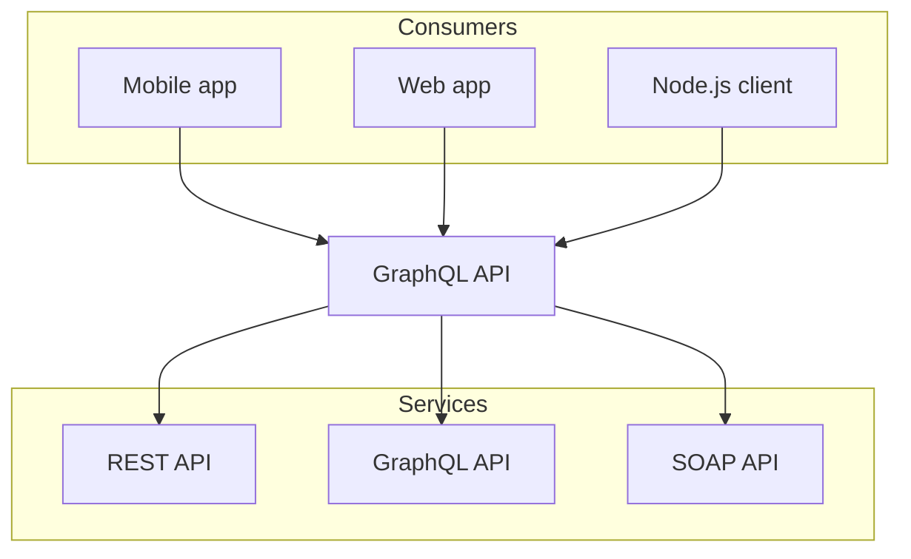

# Mermaid

Nextra는 [mermaid](https://mermaid.js.org) 다이어그램을 지원합니다. GitHub에서와 마찬가지로 마크다운 파일에서 `mermaid` 코드 블록 언어를 사용할 수 있습니다. Nextra는 기본적으로 [`@theguild/remark-mermaid`](https://npmjs.com/package/@theguild/remark-mermaid) 패키지를 사용하여 코드 블록을 `<Mermaid />` 컴포넌트로 대체합니다.

## 예시



## 사용법

````mdx filename="Markdown"

````
